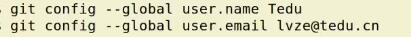

#项目管理工具-git
git是一个开源的分布式版本控制系统,用于高效的管理各种大小项目和文件.
##功能
* 防止代码丢失 备份 
* 项目版本管理和控制 通过节点跳转
* 建立各自开发环境分支 开发分支互不影响 方便合并
* 多终端开发方便互传
##特点
* 开源 *nix系统使用,可以管理各种文件
* 分部式项目管理(还有其它的如svn集中式)
* 数据管理多样化,分享速度快,数据安全
* 拥有更好的分支支持,方便多人协调

#### 集中式  
 优点: 工作简单 方便代码保密  
 缺点: 过于依赖中央处理单元 客户端之间不能交互 

#### 分布式
1. 开源思想 不保密
2. 每一个节点都类似中央处理单元 可以共享
3. 节点间互相传输数据 可以主动推送 也可以让别人获取
优点: 自由高效 不用担心个别节点出问题  比svn传输速度快
缺点: 工作方法多 操作复杂

# ***git 使用***

## 安装
`sudo apt-get install git`

### 验证
输入 `git` 会出操作git的命令

## 模块
* 工作区:项目实际操作文件夹
* 暂存区:记录工作区的内容
* 仓库区:备份工作区内容
* 远程仓库:远程主机上的git仓库
#### 注意:本地仓库中,git总希望工作区内容与仓库区保持一致,只有仓库区内容猜能和其他远程仓库交互!!!

## 配置

### 初始配置
用户名  `git config --global user.name xxx`

邮箱  `git config --global user.email xxx@xxx.xx`

配置文件位置: ~/.gitconfig

## 执行流程
创建一个文件夹作为git工作区仓库
`mkdir project`
#### 注意:git操作需要在你的工作区目录里
### 初始化仓库
`git init`
初始化后 会产生隐藏文件.git
删除 .git  就取消git目录了
### 查看仓库状态
`git status`

  
默认 位于分支 master
### 将工作内容记录到暂存区
`git add .`为所有文件  
`git add *`文件和文件夹  
`git rm --xx.txt` 取消提交
### 同步到本地仓库
`git commit xx.txt -m '本次同步说明'` 指定文件同步
`git commit -m '说明'` 所有文件同步
### 查看操作记录
`git log`  
  
commit编码 使用前7位
`git log --pretty=oneline` 一行显示记录  
q 退出  

### 从仓库区恢复文件到工作区
`git checkout -- 文件名` '--'两边有空格
### 删除仓库区文件
`git rm 文件名`  
工作目录和仓库区同时进行该操作
### 移动仓库区文件到指定文件夹(都在当前项目目录)
`git mv 文件名1 2... 文件夹名`  
工作目录和仓库区同时进行该操作
## 扩展 忽略文件  .gitignore
在 .gitignore 文件中 写入想要忽略的文件  
.idea  
*.png 多个文件  
.idea/ 文件夹  
然后 将.gitgnore 同步到仓库
`git add .gitignore
#### 隐藏文件 添加不能用 git add *
# ***版本控制***
##仓库区退回上一个commit节点
`git reset --hard HEAD^` 两个^是回退2个版本
## 仓库区退回到指定commit_id
`git reset --hard 7位commit_id`   
工作区与仓库区保持一致
## 查看所有操作
`git reflog`  
  
再通过commit_id 回退到需要的版本  

## 创建标签 *用于重要的commit_id*
`git tag v1.0 -m '版本1'`  
**为之前指定版本添加标签**  
`git tag v0.9 361a535 -m '版本0.9'`
## 查看标签
`git tag`  
显示 标签名  
`git show 标签名(v1.0)`  
显示详细信息  

## 回退到指定标签
`git reset --hard v0.9` 利用标签名  
## 删除标签
`git tag -d 标签名`

# 保存工作区
修改文件后,等待测试,不想提交到仓库的情况**可以保存工作区**    
`git stash save '这是第一种方案'` 工作区会恢复到干净状态
## 查看工作区方案
`git stash list`  

## 应用工作区方案
`git stash apply stash@{1}`
输入前面的序号来选择  
**确定好后 在提交到本地仓库**  
`git add *`  
`git commit -m 'stash'`  
## 删除工作区方案  
`git stash drop stash@{1}`  
`git stash clear` 删除全部工作区方案

# 分支管理
定义:每个人在原有代码(分支)的基础上简历自己的工作环境,单独开发,互不干扰.完成开发工作后再进行分支统一合并.

## 创建分支
`git branch Tom_dev`
## 查看分支
`git branch`  
 *绿色字体表示当前工作分支  
## 切换分支
`git checkout Tom_dev`
## 新建分支并切换到该分支
`git checkout -b jame_dev`

## 分支合并
`git checkout master`回到master分支 **合并必须在master分支进行**  
`git merge Jame_dev`  **前提是jame分支 已经同步到本地仓库 commit过**

## 分支合并的冲突问题
原master 已经合并过其他分支后 再进行合并分支操作时会产生冲突 因为原master已经发生变化
`git merge Tom_dev` 这时再合并Tom分支时  
  
此时 master状态只是增加了文件 这种冲突好解决
**只需要写入 ctrl+o 再离开 ctrl+x**  
===========
如果 master状态是文件内容的修改 在其他分支上同一文件内容也进行了修改 这种冲突不好解决
  
必须手动修改  

**此时打开该文件 会发生双方修改内容都储存在文件中**  
**注意: 在工作中尽量不要修改原文件 添加自己的文件和模块进行操作**

------------------------------------
# 远程仓库操作命令(GitHub为例)
github:一个开源的项目社区网站,拥有全球最多的开源项目.开发者可以注册网站在GitHub简历自己的项目仓库.  
[网址:GitHub](http://github.com)

# 获取项目
* 左上角搜索栏搜索想要获取的项目

* 选择项目后复制项目git地址  
 **http地址每次都要输入用户名密码**  
  **ssh地址信任计算机添加免密**  
* 在本地使用git clone方法获取
`git clone http://github.com/xxxxxx`  
**注意： 获取到本地的项目会自动和github远程仓库建立连接。且获取的项目本身也是个git项目。**   
`git pull` 就会同步更新 
## 创建git仓库
* 点击右上角加号下拉菜单，选择新的仓库
  

* 创建后获取地址信息  
  
  
## 建立连接
`git remote add origin git@gitbub.com:lvze0321/Project.git`  
`git remote` 查看远程仓库  
**注意: 一个git项目连接的远程主机名不会重复**
`git remote rm origin` 删除远程仓库  
## 将本地分支推送给远程仓库
`git push -u origin master`  
## 推送代码到远程仓库
`git push`  
## 推送标签
`git push origin v1.0`  
`git push -u orgin Tom_dev`切换分支后 该分支第一个推送 加-u  
`git push origin --tags` 推送本地所有标签到远程  
## 删除远程标签
`git push origin --delete tag v1.0`  
## 删除远程分支
`git push origin :Tom_dev`
## 强行推送旧版本
`git push --force origin`  
## 查看所有分支
`git branch -a`  
## 获取分支代码
`git pull`  

## 删除仓库
进入该仓库  
 点击settings  
拉到最下边 

 
 点击Delete...  
输入该仓库名称  删除成功

# 配置信任主机

  
SSH keys输入本机系统公钥  

**查看系统公钥**  
`ssh -keygen` 生成密钥对  
`cd .ssh`   id_rsa为私钥
`cat id_rsa.pub`  

